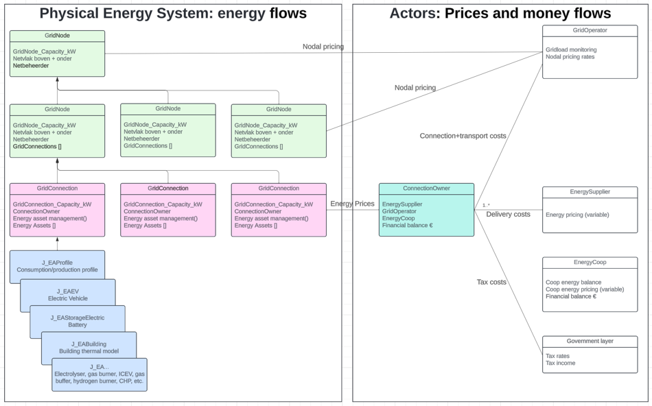

# Welcome to the Zenmo Zero Model Documentation

 

* Geen expliciete simulatie van stroom en spanning; alleen vermogens (kW) en vermogensbalans
* Netvlakken (kabels) beschouwd als ‘koperen plaat’, stations (trafo’s) hebben beperkte capaciteit. Congestie dus alleen op trafo’s
* Warmtenetten via GridNode Heat, warmtebalans gesloten binnen het model
* Voor andere energiedragers wordt geen infra gemodelleerd. Wel is het mogelijk om een gas of waterstof buffer te gebruiken.

Links to other md files:
[Modelstructuur](modelstructuur.md)
[Modeling conventions](modeling_conventions.md)
[Rekenregels](rekenregels.md)
[Energy assets](energy_assets.md)
[Energieprijzen en geldstromen](prijzen_en_geldstromen.md)
[KPI berekeningen](KPI_berekeningen.md)
[Datasets](datasets.md)
[Interfaces met andere modules](interfaces.md)
[Results_ui](results_ui.md)

## mkDocs

Made using mkDocs:
For full documentation visit [mkdocs.org](https://www.mkdocs.org).

## Commands

* `mkdocs new [dir-name]` - Create a new project.
* `mkdocs serve` - Start the live-reloading docs server.
* `mkdocs build` - Build the documentation site.
* `mkdocs -h` - Print help message and exit.

## Project layout

    mkdocs.yml    # The configuration file.
    docs/
        index.md  # The documentation homepage.
        ...       # Other markdown pages, images and other files.
