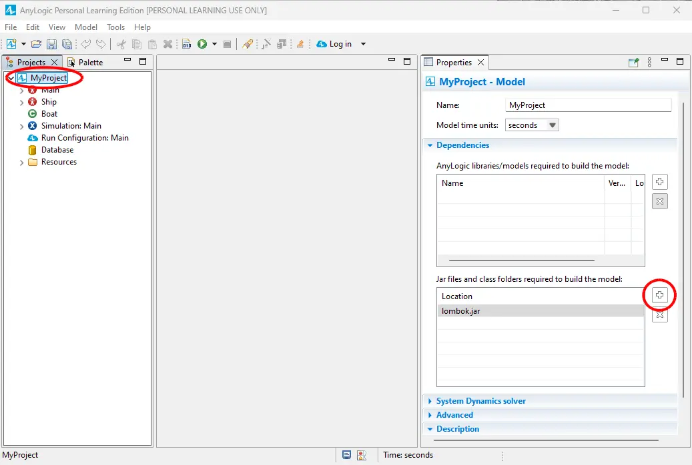
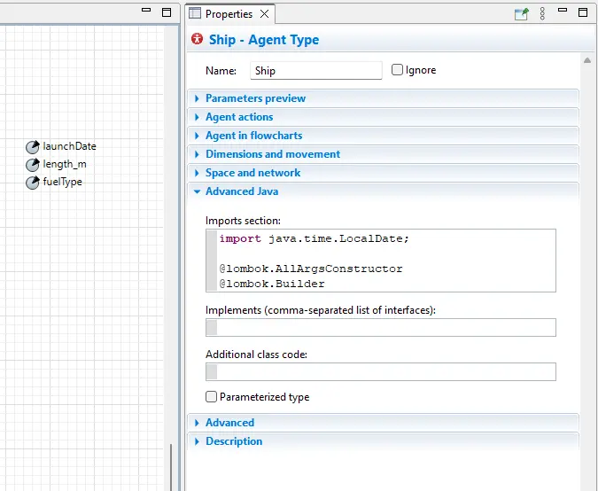
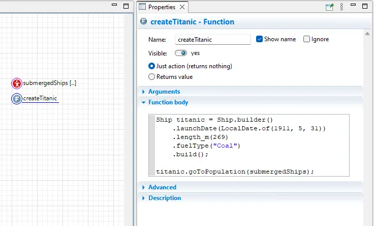

Lombok in AnyLogic
===

Installation
---

[Project Lombok](https://projectlombok.org/) can do code generation to improve
the experience of working with Java code. It can add common patterns like
builder classes, value classes, null checks, and getters.

To use it in AnyLogic:

1\. Download [lombok.jar](https://projectlombok.org/downloads/lombok.jar) and place it in the AnyLogic directory, for example
`C:\Program Files\AnyLogic 8.9 Personal Learning Edition\lombok.jar`

2\. Add the following line to `AnyLogic.ini` in the same directory:

```
-javaagent:./lombok.jar
```

It should look like this:

```
-vmargs
-Xmx4096M
-Djava.util.Arrays.useLegacyMergeSort=true
--add-modules=ALL-SYSTEM
-Dorg.eclipse.e4.ui.css.theme.disableOSDarkThemeInherit=true
-Dsun.java2d.ddscale=true
-Dsun.java2d.translaccel=true
--add-exports=java.base/jdk.internal.ref=ALL-UNNAMED
-javaagent:./lombok.jar
```

3\. Add lombok.jar to your project's dependencies.



4\. If you have a custom launch script (`.bat`, `.sh`) it may not find
`lombok.jar`. To fix it you can place the launch script in the AnyLogic
directory.

```
set CLIENT_ID=xxx
set CLIENT_SECRET=xxx
Anylogic.exe
```

5\. You can now use the annotations in your project.

Using @Builder for Agents
---

You may want to use Lombok outside of plain Java code. To create a builder class
for an Agent, add these annotations to the bottom of the imports section of that
Agent:

```java
@lombok.AllArgsConstructor
@lombok.Builder
```



Use it like so:


